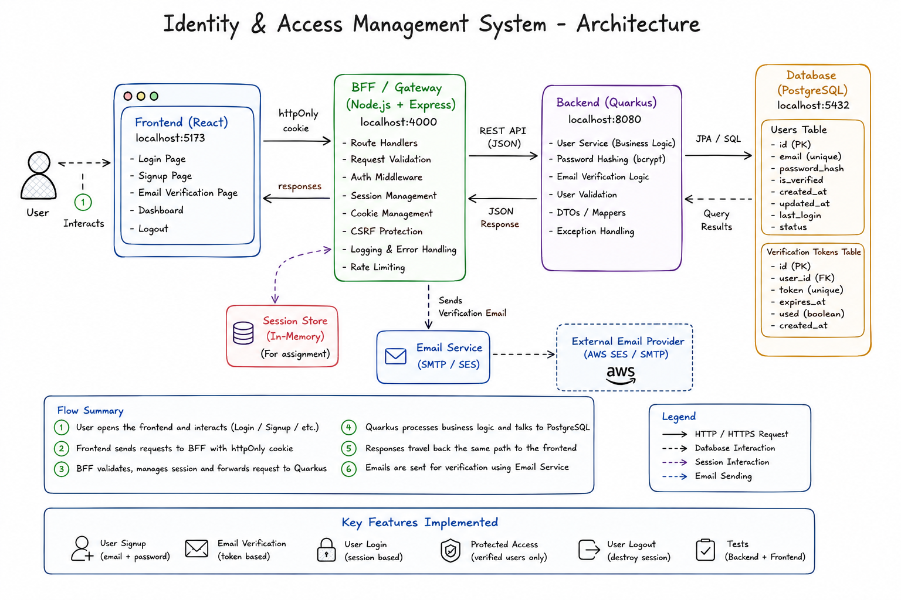

# Oppex - Identity & Access Management System

A full-stack user signup, email verification, login, and session management portal built with an enterprise **Backend-for-Frontend (BFF)** pattern.

The browser talks only to a **Node.js BFF** (sessions + cookies). The BFF forwards business requests to a **Quarkus** backend, which handles password hashing, verification logic, and database access via **PostgreSQL**. Email verification uses **6-digit OTP** codes sent through **SMTP** (Gmail).

---

## Live deployment


| Service                    | URL                                |
| -------------------------- | ---------------------------------- |
| **Portal (single origin)** | `https://oppex.duckdns.org`        |
| **GitHub**                 | `https://github.com/imdeeep/oppex` |

Frontend and backend are served from **one origin** (`oppex.duckdns.org`) via Caddy on EC2.
This keeps the session cookie first-party so login works in every browser. A split setup
(Amplify frontend + separate-domain API) fails in Safari, which blocks cross-site cookies.
See [Deployment](#deployment-aws).

---


## Table of contents

- [Assignment requirements](#assignment-requirements)
- [System architecture](#system-architecture)
- [Production architecture](#production-architecture)
- [Project structure](#project-structure)
- [Tech stack](#tech-stack)
- [Prerequisites](#prerequisites)
- [Environment variables](#environment-variables)
- [Setup & run (local)](#setup--run-local)
- [User flows](#user-flows)
- [API reference](#api-reference)
- [Database schema](#database-schema)
- [Running tests](#running-tests)
- [Security](#security)
- [Email configuration](#email-configuration)
- [Deployment (AWS)](#deployment-aws)
- [Troubleshooting](#troubleshooting)

---


## Assignment requirements


| Requirement                               | Implementation                                              |
| ----------------------------------------- | ----------------------------------------------------------- |
| Sign up with email + password             | React signup → BFF → Quarkus                                |
| Password stored as salted hash            | bcrypt via Quarkus `PasswordService`                        |
| Email verification after signup           | 6-digit OTP via SMTP, 10-minute expiry                      |
| Login with verified / unverified messages | Exact assignment copy from Quarkus                          |
| Logout + redirect to login                | Session destroyed in Node BFF                               |
| Backend + frontend tests                  | JUnit, Vitest, Node test runner                             |
| Quarkus services + Node session layer     | BFF pattern as specified                                    |
| Tech stack                                | Quarkus + PostgreSQL + React + Node + Maven                 |
| AWS deployment                            | EC2 Docker Compose (Caddy + frontend + BFF + Quarkus) + Neon (DB) |


---


## System architecture

<p align="center">
  
</p>

> **Note:** The diagram shows port `4000` for the BFF and a separate verification-tokens table. This implementation uses port **3000** for the BFF and stores OTP fields on the `users` table.


### How the layers work (local)

```
Browser (React)  →  Node BFF  →  Quarkus API  →  PostgreSQL
                         ↑
                   Session cookie (oppex.sid)

Quarkus  →  SMTP  →  User inbox (6-digit OTP)
```


| Layer        | Folder        | Port (local) | Role                                      |
| ------------ | ------------- | ------------ | ----------------------------------------- |
| **Frontend** | `client/`     | `5173`       | Login, signup, verify, portal UI          |
| **BFF**      | `node-proxy/` | `3000`       | Sessions, cookies, CORS, proxy to Quarkus |
| **Backend**  | `server/`     | `8080`       | User service, bcrypt, OTP, JPA            |
| **Database** | PostgreSQL    | `5432`       | Neon (cloud) or local Postgres            |


### Request flow (signup)

1. User submits email + password on the React signup page.
2. Browser sends `POST /auth/signup` to the BFF with `credentials: include`.
3. BFF forwards to Quarkus `POST /api/users/signup`.
4. Quarkus hashes the password, saves the user, generates a 6-digit OTP, and sends email.
5. User enters OTP on `/verify`; BFF proxies to Quarkus `/api/users/verify`.
6. After verification, user logs in. BFF creates a session **only for verified users**.
7. Protected portal routes call `GET /auth/me` to read the session.

---


## Production architecture

Everything is served from **one origin** (`https://oppex.duckdns.org`) and runs as a
single Docker Compose stack on one EC2 instance. Caddy terminates TLS and routes
traffic to the frontend or the BFF.

```
Browser  →  https://oppex.duckdns.org  (Caddy container :443, auto HTTPS)
                 │
                 ├─ /auth/*, /health ─►  node-proxy:3000  ─►  server:8080  ─►  Neon PostgreSQL
                 │                                                          └►  Gmail SMTP
                 └─ everything else  ─►  frontend:80 (nginx + React build)
```


| Component | Where | Notes |
| --------- | ----- | ----- |
| Reverse proxy / TLS | **Caddy** container | Auto Let's Encrypt cert for DuckDNS domain |
| Frontend | **nginx** container | Serves the built React SPA |
| BFF | **node-proxy** container | Sessions, cookies, proxy to Quarkus |
| Backend | **server** container | Quarkus, internal only |
| Database | **Neon** | PostgreSQL, external |
| DNS | **DuckDNS** (free) | Points `oppex.duckdns.org` to EC2 IP |


### Why single origin

Locally, frontend and BFF share `localhost`, so cookies just work.

A split setup (frontend on `amplifyapp.com`, API on `duckdns.org`) makes the session
cookie **third-party**. Safari (and increasingly Chrome) **block third-party cookies**,
so login succeeds but `/auth/me` returns 401.

Serving both from `oppex.duckdns.org` makes the cookie **first-party**, which works in
every browser — no CORS, no `SameSite=None` fragility. Caddy handles HTTPS + routing.

> An earlier version used AWS Amplify for the frontend. It was dropped because of the
> third-party-cookie problem above. `amplify.yml` remains in the repo for reference only.

---


## Project structure

```
oppex/
├── client/                 # React frontend (React Router 8 + Vite + Tailwind)
│   ├── Dockerfile          # Build SPA → serve with nginx
│   └── nginx.conf          # SPA routing fallback
├── node-proxy/             # Node.js BFF (Express + express-session)
│   └── Dockerfile
├── server/                 # Quarkus backend (Maven)
│   └── Dockerfile
├── docker-compose.yml      # Full stack: caddy + frontend + node-proxy + server
├── Caddyfile               # TLS + routing (single origin)
├── amplify.yml             # Legacy Amplify build spec (unused, kept for reference)
├── sysarch.png             # Architecture diagram (referenced above)
├── docs/context.md         # Extended architecture notes
└── README.md
```

---


## Tech stack


| Area       | Technology                                                 |
| ---------- | ---------------------------------------------------------- |
| Frontend   | React 19, React Router 8, TypeScript, Tailwind CSS 4, Vite |
| BFF        | Node.js, Express, express-session, CORS                    |
| Backend    | Quarkus 3.37, Java 17, Hibernate ORM, Panache              |
| Database   | PostgreSQL (Neon)                                          |
| Email      | Quarkus Mailer + Gmail SMTP                                |
| Deployment | AWS EC2, Docker Compose, Caddy, nginx, DuckDNS             |
| Tests      | JUnit 5, Vitest, Node `--test`                             |


---


## Prerequisites


| Tool                    | Version                         | Used by             |
| ----------------------- | ------------------------------- | ------------------- |
| Java JDK                | 17+                             | Quarkus             |
| Node.js                 | 18+ (22.22+ for Amplify builds) | BFF + React         |
| npm                     | 9+                              | BFF + React         |
| PostgreSQL              | 14+ or Neon                     | User storage        |
| Gmail App Password      | -                               | Verification emails |
| Docker + Docker Compose | -                               | EC2 deployment      |


Maven is bundled via `./mvnw` in `server/`.

---


## Environment variables

Copy from each folder's `.env.example`. **Never commit** `.env` **files** (they are gitignored).

### Backend - `server/.env`


| Variable        | Description                                          |
| --------------- | ---------------------------------------------------- |
| `DB_USERNAME`   | Neon PostgreSQL username                             |
| `DB_PASSWORD`   | Neon password                                        |
| `DB_JDBC_URL`   | `jdbc:postgresql://...neon.tech/...?sslmode=require` |
| `MAIL_FROM`     | Gmail sender address                                 |
| `MAIL_HOST`     | `smtp.gmail.com`                                     |
| `MAIL_PORT`     | `587`                                                |
| `MAIL_USERNAME` | Gmail address                                        |
| `MAIL_PASSWORD` | Gmail app password                                   |


### BFF - `node-proxy/.env`


| Variable         | Local                   | Production (EC2)               |
| ---------------- | ----------------------- | ----------------------------- |
| `PORT`           | `3000`                  | `3000`                        |
| `QUARKUS_URL`    | `http://localhost:8080` | `http://server:8080`         |
| `SESSION_SECRET` | any dev string          | long random string (32+ chars) |
| `CLIENT_URL`     | `http://localhost:5173` | `https://oppex.duckdns.org`  |
| `NODE_ENV`       | `development`           | `production`                  |


### Frontend - `client/.env`


| Variable       | Local                   | Production                          |
| -------------- | ----------------------- | ---------------------------------- |
| `VITE_API_URL` | `http://localhost:3000` | *(unset — same-origin `/auth/*`)* |


In production the frontend is served from the same origin as the API, so `VITE_API_URL`
is left **unset** and the build uses relative paths. The Docker build never copies `.env`
(see `client/.dockerignore`), so this is automatic.

---


## Setup & run (local)

Three terminals, in this order:

```bash
# Terminal 1 - Quarkus
cd server && ./mvnw quarkus:dev

# Terminal 2 - BFF
cd node-proxy && npm run dev

# Terminal 3 - Frontend
cd client && npm run dev
```

Open [http://localhost:5173](http://localhost:5173).

### Local checklist

- [ ] Sign up → 6-digit OTP email arrives
- [ ] Verify → login → portal (verified users only)
- [ ] Logout → `/portal` redirects to login

---


## User flows


### Login messages (assignment copy)


| State      | Message                                                | Session | Portal |
| ---------- | ------------------------------------------------------ | ------- | ------ |
| Unverified | *You need to validate your email to access the portal* | No      | No     |
| Verified   | *Your email is validated. You can access the portal*   | Yes     | Yes    |


### OTP

- **6-digit numeric** code, expires in **10 minutes**
- Resend available on `/verify`

---


## API reference


### BFF (browser-facing)


| Method | Path                | Auth    | Description  |
| ------ | ------------------- | ------- | ------------ |
| `GET`  | `/health`           | -       | Health check |
| `POST` | `/auth/signup`      | -       | Register     |
| `POST` | `/auth/verify`      | -       | Verify OTP   |
| `POST` | `/auth/resend-code` | -       | Resend OTP   |
| `POST` | `/auth/login`       | -       | Login        |
| `POST` | `/auth/logout`      | Session | Logout       |
| `GET`  | `/auth/me`          | Session | Current user |


All browser requests use `credentials: include`.

### Quarkus (internal, BFF only)


| Method | Path                     |
| ------ | ------------------------ |
| `POST` | `/api/users/signup`      |
| `POST` | `/api/users/verify`      |
| `POST` | `/api/users/resend-code` |
| `POST` | `/api/users/login`       |


---


## Database schema

Table: `users`


| Column               | Notes             |
| -------------------- | ----------------- |
| `id`                 | Primary key       |
| `email`              | Unique, lowercase |
| `password_hash`      | bcrypt            |
| `is_verified`        | boolean           |
| `verification_token` | 6-digit OTP       |
| `otp_expires_at`     | expiry timestamp  |
| `created_at`         | account creation  |


---


## Running tests

```bash
cd server && ./mvnw test
cd node-proxy && npm test
cd client && npm test
```

---


## Security


| Feature                   | Implementation                                    |
| ------------------------- | ------------------------------------------------- |
| Password hashing          | bcrypt (Quarkus)                                  |
| Sessions                  | `express-session`, cookie `oppex.sid`             |
| Cookie flags (local)      | `HttpOnly`, `SameSite=Lax`                        |
| Cookie flags (production) | `HttpOnly`, `SameSite=None`, `Secure`             |
| Verified-only sessions    | BFF sets session only when `verified: true`       |
| CORS                      | `CLIENT_URL` allowlist                            |
| Quarkus not public        | Docker `expose: 8080` only - no host port mapping |


---


## Email configuration

Gmail (recommended for Gmail recipients):

1. Enable 2FA on Google account.
2. Create an [App Password](https://myaccount.google.com/apppasswords).
3. Set `MAIL_*` in `server/.env`.

**Dev mode:** `%dev.quarkus.mailer.mock=false` in `application.properties` forces real SMTP in `quarkus:dev` (Quarkus mocks mail by default in dev).

---


## Deployment (AWS)

The whole app runs as one Docker Compose stack on a single EC2 instance, served from
one origin (`https://oppex.duckdns.org`).

### 1. Push code to GitHub

```bash
git add .
git commit -m "Oppex IAM portal"
git push origin main
```

Ensure `sysarch.png` is committed at the repo root (next to `README.md`) so the diagram renders on GitHub.

### 2. Database — Neon PostgreSQL

1. Create a project at [neon.tech](https://neon.tech).
2. Copy the connection string into `server/.env` on EC2.

### 3. DNS — DuckDNS

1. [duckdns.org](https://www.duckdns.org) → create a subdomain (e.g. `oppex`).
2. Point `oppex.duckdns.org` to your EC2 public IP.

### 4. Launch EC2

Ubuntu 22.04, `t2.micro`, key pair `oppex.pem`.

**Security group inbound:**

| Port | Source | Purpose |
| ---- | ------ | ------- |
| 22 | My IP | SSH |
| 80 | `0.0.0.0/0` | HTTP → HTTPS redirect + Let's Encrypt |
| 443 | `0.0.0.0/0` | HTTPS (the only public app port) |

Ports 3000 (BFF), 8080 (Quarkus), and the frontend are internal to the Docker network — not exposed.

### 5. Install Docker on EC2

```bash
sudo apt update
sudo apt install -y docker.io docker-compose-v2 git
sudo usermod -aG docker ubuntu
# log out and back in
```

### 6. Clone + configure env

```bash
git clone https://github.com/imdeeep/oppex.git
cd oppex
nano server/.env        # Neon + Gmail
nano node-proxy/.env    # see below
```

`node-proxy/.env` (production):

```env
PORT=3000
QUARKUS_URL=http://server:8080
SESSION_SECRET=<long-random-string>
CLIENT_URL=https://oppex.duckdns.org
NODE_ENV=production
```

`client` needs no env — the Docker build produces a same-origin bundle.

### 7. Build + start the full stack

```bash
docker compose up -d --build
docker compose ps        # caddy, frontend, node-proxy, server all Up
```

Caddy automatically obtains a Let's Encrypt certificate for `oppex.duckdns.org`.

### 8. Verify

```bash
curl https://oppex.duckdns.org/health   # → {"status":"ok"}
```

- [ ] Open `https://oppex.duckdns.org` → signup → OTP email → verify → login → portal
- [ ] DevTools → Cookies → `oppex.sid` (first-party, `Secure`) on `oppex.duckdns.org`
- [ ] Logout returns to login

### Update / redeploy

```bash
cd ~/oppex
git pull origin main
docker compose up -d --build
```

### Containers

| Service | Image / build | Exposure |
| ------- | ------------- | -------- |
| `caddy` | `caddy:2-alpine` | Public 80/443 |
| `frontend` | `client/Dockerfile` (nginx) | Internal :80 |
| `node-proxy` | `node-proxy/Dockerfile` (Node 20) | Internal :3000 |
| `server` | `server/Dockerfile` (Quarkus/JRE 17) | Internal :8080 |

For a real product: replace DuckDNS with a purchased domain, use AWS SES for email, add backups/monitoring, and keep only 22/443 open.

---


## Troubleshooting


### No verification email in local dev

Quarkus mocks mail in dev by default. This repo sets `%dev.quarkus.mailer.mock=false`. Restart `./mvnw quarkus:dev` after mail config changes.

### Login works but portal says Unauthorized (production)

This was the main deployment gotcha — a **third-party cookie** being blocked by Safari.
The fix is the single-origin setup: frontend + API both under `oppex.duckdns.org`.
Confirm:

- All requests in DevTools go to `oppex.duckdns.org` (not a second domain)
- `CLIENT_URL=https://oppex.duckdns.org` and `NODE_ENV=production` on EC2
- Caddy is serving HTTPS and the `oppex.sid` cookie shows as first-party

### Caddy container can't bind port 80/443

If a host Caddy was installed earlier, stop it so the container can use the ports:

```bash
sudo systemctl stop caddy && sudo systemctl disable caddy
```

### SSH times out

Port 22 not open to your current IP, or the instance IP changed. Re-add SSH (source **My IP**) in the security group, and update DuckDNS if the EC2 IP changed.


### `git pull` blocked on EC2

```bash
git checkout -- .
git pull origin main
```

Never edit tracked files on EC2 - only `.env` files (gitignored).

### Quarkus not reachable on port 8080 from browser

Expected. Quarkus is internal to Docker. Test via BFF: `curl http://localhost:3000/health` or `curl https://oppex.duckdns.org/health`.